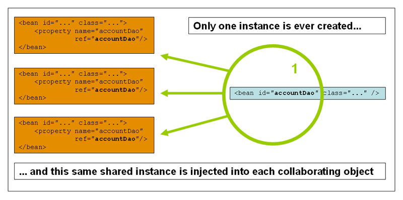

### 1. 스프링 프레임워크

 

### 2. IoC컨테이너와 DI
Ioc(Inversion of Control)은 DI(Dependency injection)으로도 알려져있다.

스프링은 오브젝트를 정의한 후 별개의 컨테이너를 통해 생성한 오브젝트들을 관리하고, 
빈을 생성할 때 의존성들을 주입해준다.

직접 오브젝트를 new를 통해 생성했던 기존과는 반대의 개념이므로 제어의 역전(inversion of control)이라고 부른다.
org.springframework.beans 및 org.springframework.context 패키지는 spring Ioc컨테이너의 기초이며,
여기서 BeanFactory인터페이스가 모든 오브젝트를 관리하는 로직을 담당한다.

흔히 말하는 ApplicationContext의 parent interface를 타고 올라가다보면 이 BeanFactory의 하위 인터페이스임을 확인할 수 있다.

일반적으로 작성한 class, 즉 POJO오브젝트는 XML 혹은 어노테이션, 자바 코드를 통해 메타데이터로 읽어들여지고,
해당 오브젝트는 스프링 컨테이너에 등록되면서 스프링 애플리케이션에서 동작하게 된다.
> 최근에는 메타데이터를 XML보다는 Java기반으로 구성하는게 일반적이다.

ApplicationContext의 getBeanFactory() 메소드를 호출하면 DefaultListableBeanFactory를 반환하는데,
이 DefaultListableBeanFactory의 registerSingleton()과 registerBeanDefinition()을 통해 빈이 등록된다.

빈 이름은 일반적으로 클래스이름의 첫 문자를 소문자로 변경한다.
그런데 1, 2번째 문자가 모두 대문자라면 원래 이름이 유지된다.
이건 java.beans.Introspector의 decapitalize메소드와 동일하다.
AnnotationBeanNameGenerator의 buildDefaultBeanName메소드를 보면,
빈 네임을 만들 때 실제로 해당 메소드를 사용하는 것을 확인할 수 있다.

bean식별자는 id로 하나만 지정할 수도 있지만, 다른 alias를 쓰고자 하는 경우 name에서 쉼표, 세미콜론으로 지정할 수 있다.
''
 

### 2.1. 의존성주입
일반적인 엔터프라이즈 애플리케이션은 단일 오프젝트로 구성되지 않는다.

오브젝트들이 협력하여 하나의 어플리케이션을 이루게 되는데, 이 때 오브젝트의 종속관계를 정의하는 것을 의존성 주입이라고 한다.
DI를 통해 코드가 더 깔끔해지며, 클래스를 테스트하기가 더 쉬워지고, 단위테스트에서 mocking 및 stub을 사용할 수 있다.

의존성주입 방법에는 constructor injection과 setter injection이 있는데,
스프링팀은 일반적으로 constructor injection을 지지한다.
이유는 불변 오브젝트로 컴포넌트를 정의하고, 종속성이 null이 아님을 보증하기 때문이다. 
더 나아가서, 생성자로 주입된 컴포넌트들은 항상 완전히 초기화된 상태로 클라이언트에게 리턴된다.

또한 주입 대상 오브젝트가 많으면 코드 스멜을 유발한다.
이 때, constructor injection을 사용하게 되면 클래스에 너무 많은 책임이 있으므로 리팩터링해야 함을 알 수 있다.
> constructor injection을 주로 사용하는 경우, 순환 종속이 발생할 수 있다.
> 예를들어 A클래스가 B클래스를 주입받고, B클래스는 A클래스를 주입받는 경우, IoC컨테이너는 순환참조를 하게되고 BeanCurrentlyInCreationException
> 를 유발한다.
> 이 때 추천하진 않지만 constructor injection대신 setter injection으로 해결할 수는 있다. 

 

### 4. 결론
